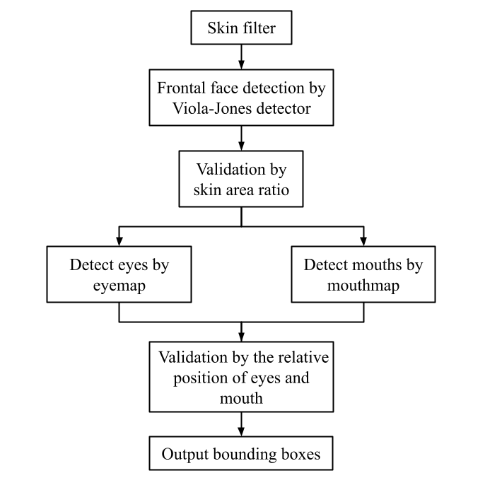

# Face Detection using Haar Cascade, Facial Features and Skin Detection


## Environment
- python
- NumPy
- OpenCV
- Matplotlib
- skimage
- scipy
- [libsvm](https://github.com/cjlin1/libsvm)

## How to Run
```shell
bash ./run.sh
```